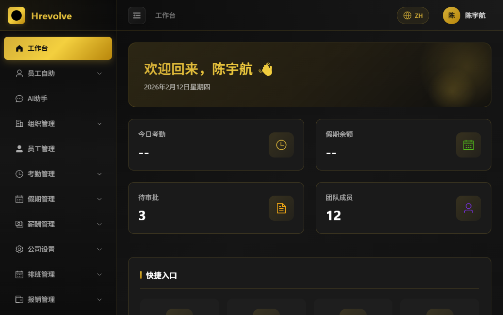
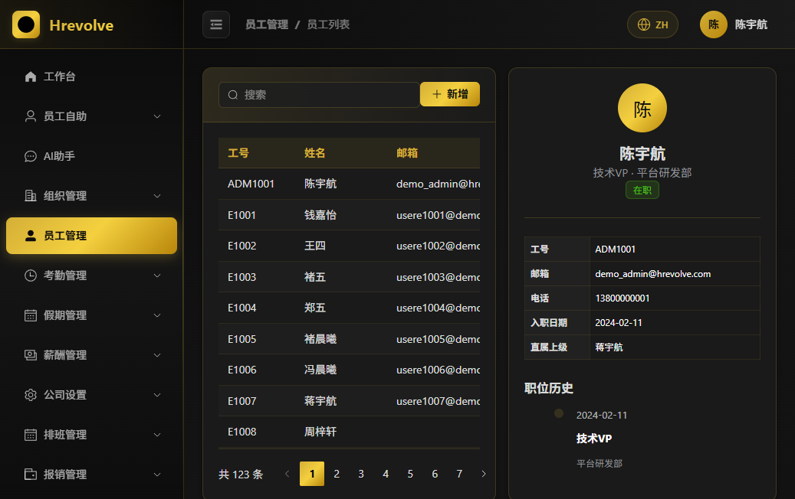
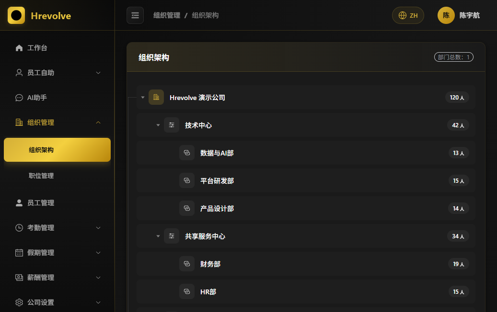
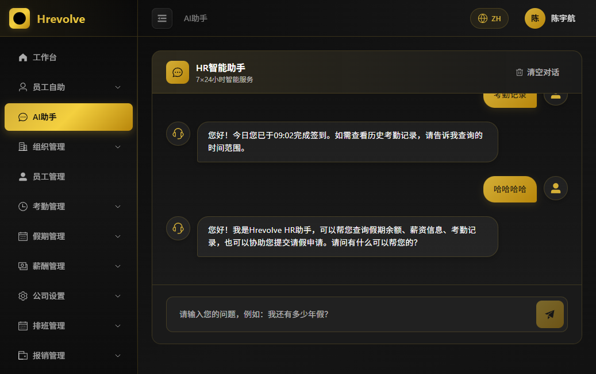

# Hrevolve - 企业级 SaaS 人力资源管理系统

<p align="center">
  <strong>现代化 · 智能化 · 一体化</strong>
</p>

<p align="center">
  
  
  
  
  
</p>

---

## 📖 项目简介

Hrevolve 是一个面向现代企业的 SaaS 人力资源管理平台，采用 **Clean Architecture + DDD（领域驱动设计）** 构建。系统深度融合 AI 能力，致力于从传统的"管理工具"转变为"员工服务平台"和"企业战略决策引擎"。

## � 在线演示

- 演示地址：http://8.138.89.167:8080/
- 演示账号（默认已开启演示数据）
  - 管理员：`demo_admin / demo123`
  - HR：`demo_hr / demo123`
  - 员工：`demo_user / demo123`

## 🖼️ 界面截图

<p align="center">
  
  
</p>
<p align="center">
  
  
</p>

## �️ 系统架构

```
┌─────────────────────────────────────────────────────────────┐
│                        Frontend                              │
│                   Vue 3 + TypeScript + Vite                  │
└─────────────────────────────┬───────────────────────────────┘
                              │ REST API
┌─────────────────────────────▼───────────────────────────────┐
│                      Hrevolve.Web                            │
│              ASP.NET Core Web API · 控制器 · 中间件           │
├─────────────────────────────────────────────────────────────┤
│                    Hrevolve.Application                      │
│                CQRS · MediatR · 业务逻辑编排                  │
├──────────────────────┬──────────────────────────────────────┤
│   Hrevolve.Domain    │           Hrevolve.Agent             │
│  实体 · 值对象 · 事件  │    Microsoft Agent Framework · AI    │
├──────────────────────┴──────────────────────────────────────┤
│                   Hrevolve.Infrastructure                    │
│           EF Core · PostgreSQL · Redis · 外部服务            │
├─────────────────────────────────────────────────────────────┤
│                      Hrevolve.Shared                         │
│              多租户 · 通用组件 · 异常处理 · 工具类             │
└─────────────────────────────────────────────────────────────┘
```

## 🛠️ 技术栈

| 层级 | 技术选型 |
|------|----------|
| **后端框架** | .NET 10 / ASP.NET Core Web API |
| **前端框架** | Vue 3 + TypeScript + Vite |
| **UI 组件** | Element Plus |
| **AI 框架** | Microsoft Agent Framework + Microsoft.Extensions.AI |
| **数据库** | PostgreSQL 16 |
| **ORM** | Entity Framework Core 10 |
| **缓存** | Redis 7 |
| **认证** | JWT + OAuth 2.0 (SSO) |
| **日志** | Serilog |
| **API 文档** | Swagger / OpenAPI |

## ✨ 核心功能

### 基础模块
- 🏢 **组织架构管理** - 树状结构，邻接表 + 路径枚举
- 👤 **员工全生命周期** - SCD Type 2 历史追溯，支持任意时点查询
- 🔐 **用户认证** - JWT、SSO、MFA、微信扫码登录
- 🛡️ **RBAC 权限控制** - 细粒度权限管理

### 业务模块
- ⏰ **考勤管理** - 多源打卡、智能排班、工时核算
- 📅 **假期管理** - 策略引擎、自动计算余额、审批流
- 💰 **薪酬管理** - 规则引擎、批量计算、薪资单
- 💳 **报销管理** - 全流程线上化

### 智能模块
- 🤖 **AI 助手** - 基于 RAG 的 HR Bot，7×24 小时服务
- 📊 **数据分析** - 人力资本仪表盘
- 🔮 **离职预测** - 员工高离职风险预警（规划中）

### 多租户架构
- 🔒 Query Rewriting + RLS 双重数据隔离
- 🔑 Per-Tenant Key 敏感数据加密
- 🏠 支持独立数据库部署（高安全场景）

## � 使用手册

### 1) 登录与角色

- 打开系统后进入登录页，输入用户名与密码登录。
- 演示环境常用账号：
  - 系统管理员 `demo_admin`：用于系统设置、组织/员工/权限配置等全量功能演示
  - HR 管理员 `demo_hr`：用于人事相关流程（员工、假期、审批等）
  - 普通员工 `demo_user`：用于员工自助（考勤、请假、薪资单、个人信息）
- 生产环境请在首次登录后立即修改默认密码，并关闭演示数据种子。

### 2) 工作台（首页）

- 进入后默认展示今日考勤、假期余额、待审批、团队成员等概览。
- 常用快捷入口：请假申请、考勤记录、薪资查询、AI 助手。

### 3) 员工管理

- 路径：左侧菜单「员工管理」→「员工列表」
- 支持搜索与查看详情：员工号、部门、职位、状态、入职日期等。
- 新增员工：点击「新增」，填写基础信息后保存（演示数据中已内置员工样本）。

### 4) 组织管理

- 路径：左侧菜单「组织管理」→「组织架构」
- 以树状结构展示公司 → 部门 → 子部门，并显示人数统计。
- 常见场景：维护部门层级、梳理组织结构、为员工配置部门归属。

### 5) 考勤管理（含员工自助）

- 员工自助：左侧菜单「员工自助」可查看个人考勤、请假、薪资等信息。
- 管理侧：左侧菜单「考勤管理」可查看考勤记录、班次与排班相关配置。

### 6) 假期管理（申请与审批）

- 员工申请：在「员工自助」中发起请假申请，或从工作台快捷入口进入。
- 审批处理：管理角色在「假期管理」中处理待审批请求，并可查看假期类型与规则配置。

### 7) 薪酬管理

- 员工侧：在「员工自助」查看我的薪资单与历史记录。
- 管理侧：在「薪酬管理」维护薪酬周期与薪资记录（演示环境提供样例数据）。

### 8) AI 助手

- 路径：左侧菜单「AI助手」
- 可直接提问（示例）：
  - “我还有多少年假？”
  - “帮我查询上个月的考勤记录”
  - “我想请假 2026-02-20 到 2026-02-21，原因感冒”

### 9) 常见问题

- 登录失败：确认账号密码是否正确；演示环境建议使用 `demo_* / demo123`。
- 数据为空：确认是否开启演示数据种子（Docker 默认 `SEED_DEMO=true`）。
- 多租户接入：后端支持通过 `X-Tenant-Id`、子域名或 `?tenant=` 识别租户（详见后端文档）。

## �� 项目结构

```
Hrevolve/
├── Backend/                      # 后端项目
│   ├── Hrevolve.Domain/          # 领域层 - 实体、值对象、领域事件
│   ├── Hrevolve.Shared/          # 共享层 - 通用组件、多租户
│   ├── Hrevolve.Infrastructure/  # 基础设施层 - 数据访问、外部服务
│   ├── Hrevolve.Application/     # 应用层 - CQRS、业务逻辑
│   ├── Hrevolve.Agent/           # AI 代理层 - Agent Framework
│   └── Hrevolve.Web/             # Web 层 - API 控制器
├── Frontend/                     # 前端项目
│   └── hrevolve-web/             # Vue 3 应用
└── Design/                       # 设计文档
    ├── RequirementsDocument.md   # 需求文档
    └── *.drawio                  # 架构图
```

## 🚀 快速开始

### Docker 一键启动（推荐）

```bash
# 复制环境变量文件
# Windows PowerShell：
#   Copy-Item .env.example .env
# macOS/Linux：
#   cp .env.example .env

# 修改 .env 里的 JWT_KEY（至少 32 字符）

# 启动（首次会构建镜像）
docker compose up -d --build
```

启动后访问：
- Web：`http://localhost:8080`
- 后端健康检查：`http://localhost:8080/api/health`

### 环境要求

- .NET 10 Preview SDK
- Node.js 18+
- PostgreSQL 16+
- Redis 7+

### 后端启动

```bash
cd Backend

# 还原依赖
dotnet restore

# 数据库迁移
dotnet ef migrations add InitialCreate -p Hrevolve.Infrastructure -s Hrevolve.Web
dotnet ef database update -p Hrevolve.Infrastructure -s Hrevolve.Web

# 运行
dotnet run --project Hrevolve.Web
```

### 前端启动

```bash
cd Frontend/hrevolve-web

# 安装依赖
npm install

# 开发模式
npm run dev

# 生产构建
npm run build
```

### 访问地址

- 后端 API：`https://localhost:5001`
- API 文档：`https://localhost:5001/swagger`
- 前端应用：`http://localhost:5173`

## 📚 文档

- [Docker 部署](DEPLOYMENT.md)
- [后端开发文档](Backend/README.md)
- [前端开发文档](Frontend/README.md)
- [需求规格说明](Design/RequirementsDocument.md)
- [AI 助手设计](Design/Agent.md)

## 📄 许可证

[MIT License](LICENSE)
